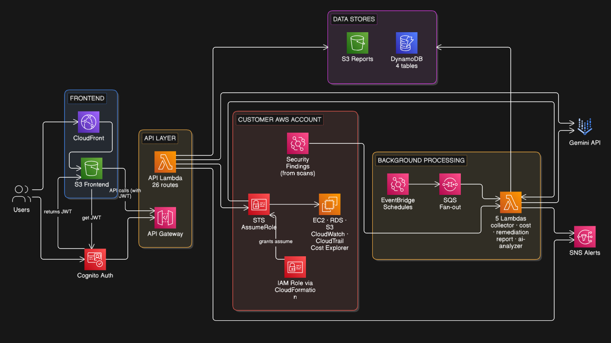

# Cloud Guardian

**Cloud Guardian** is a multi-tenant AWS monitoring, cost-optimization, and auto-remediation platform. It connects to a customer's AWS account via a cross-account IAM role, continuously scans for security misconfigurations and cost waste, and can automatically remediate issues in real time — backed by an AI analyst for natural-language insights.

## Architecture



### How it flows

1. **Frontend** — A Next.js app served from S3 behind CloudFront. Users authenticate via **Cognito** and receive a JWT, which is attached to every API call.
2. **API Layer** — API Gateway forwards authenticated requests to a single **API Lambda** (26 routes) that handles metrics, anomalies, cost suggestions, remediation actions, reports, security scans, and the AI agent.
3. **Customer AWS Account** — Using **STS AssumeRole** against an **IAM Role deployed via CloudFormation** in the customer's own account, Cloud Guardian reads EC2/RDS/S3/CloudWatch/CloudTrail/Cost Explorer data and performs scoped remediation actions, without ever storing customer credentials.
4. **Background Processing** — **EventBridge schedules** trigger scans that fan out through **SQS** to 5 specialized Lambdas: collector, cost optimizer, remediation, report generator, and AI analyzer.
5. **Data Stores** — Findings and metrics are persisted to **DynamoDB** (4 tables) and generated reports to **S3**.
6. **Integrations** — The AI analyzer calls the **Gemini API** for natural-language security/cost insights, and **SNS** delivers real-time alerts.

## Features

- **Real-time security monitoring** — detects public S3 buckets, open SSH security groups, and root account logins via CloudTrail + EventBridge, with automatic remediation.
- **Cost optimization** — flags idle EC2 instances, unattached EBS volumes, unused Elastic IPs, and oversized RDS/EC2 resources, with one-click fixes (stop, delete, release, resize).
- **Compliance scoring & cost forecasting** — aggregated account health and spend projections.
- **AI-powered agent** — ask natural-language questions about your account's security and cost posture, powered by Gemini.
- **Audit logs & reports** — historical audit trail and generated PDF/JSON reports stored in S3.
- **Multi-account support** — customers connect their own AWS account via a CloudFormation-deployed IAM role; Cloud Guardian never stores long-lived credentials.

## Tech Stack

| Layer | Technology |
|---|---|
| Frontend | Next.js 16, React 19, Tailwind CSS, AWS Amplify, Recharts |
| Auth | Amazon Cognito (JWT) |
| API | API Gateway + AWS Lambda (Python) |
| Async processing | Amazon EventBridge, SQS, Lambda |
| Data | Amazon DynamoDB, Amazon S3 |
| Cross-account access | AWS STS AssumeRole, IAM Role via CloudFormation |
| AI | Google Gemini API |
| Alerting | Amazon SNS |
| CDN / hosting | Amazon CloudFront, S3 static hosting |
| CI/CD | GitHub Actions |

## Repository Structure

```
cloud-guardian/
├── frontend/                   # Next.js frontend (Cognito auth, dashboards, reports UI)
├── lambdas/
│   ├── api/                    # Main API Lambda — 26 REST routes behind API Gateway
│   ├── collector/               # Collects metrics/security findings from customer accounts
│   ├── cost_optimizer/          # Detects idle/unused/oversized resources
│   ├── remediation/             # Executes auto-remediation actions (stop, delete, release, fix)
│   ├── report_generator/        # Generates and stores account reports
│   └── ai_analyzer/             # Gemini-powered security/cost analysis
├── cf-function.js               # CloudFront function for Next.js static-export URL rewriting
├── .github/workflows/deploy.yml # CI/CD: builds Lambdas + frontend, deploys to AWS
├── tests/                       # Test suite
└── requirements.txt              # Shared Python dependencies
```

## Getting Started

### Prerequisites

- Node.js 20+
- Python 3.11+
- An AWS account with permissions to deploy Lambda, API Gateway, Cognito, S3, CloudFront, DynamoDB, SNS, and EventBridge

### Clone the repository

```bash
git clone https://github.com/RavalDhruv21/Cloud-guardian.git
cd Cloud-guardian
```

### Backend (Lambdas)

```bash
pip install -r requirements.txt
pytest
```

Each Lambda under `lambdas/<name>/` has its own `requirements.txt` and `handler.py`, and is deployed independently.

### Frontend

```bash
cd frontend
npm install
npm run dev
```

Set the following environment variables (see `.github/workflows/deploy.yml` for the production values):

```
NEXT_PUBLIC_APP_URL
NEXT_PUBLIC_COGNITO_USER_POOL_ID
NEXT_PUBLIC_COGNITO_CLIENT_ID
NEXT_PUBLIC_COGNITO_DOMAIN
NEXT_PUBLIC_REGION
NEXT_PUBLIC_API_URL
NEXT_PUBLIC_AWS_ACCOUNT_ID
```

### Connecting a customer AWS account

Customers deploy the provided CloudFormation template (`frontend/public/cloudguardian-role.yaml`) into their own account. It provisions:

- A scoped **IAM role** that Cloud Guardian assumes via STS to read metrics/findings and perform remediation
- A **multi-region CloudTrail** trail for audit logging
- **EventBridge rules** that forward S3 public-access, open-SSH, and root-login events to Cloud Guardian in real time

The resulting Role ARN is pasted into the Cloud Guardian dashboard to complete the connection.

## Deployment

Deployment is fully automated via [GitHub Actions](.github/workflows/deploy.yml) on every push to `master`:

1. Packages and deploys all 6 Lambda functions
2. Builds the Next.js frontend as a static export
3. Syncs the build to S3 with appropriate cache headers
4. Updates the CloudFront rewrite function and invalidates the cache

## License

This project is licensed under the [MIT License](LICENSE).
